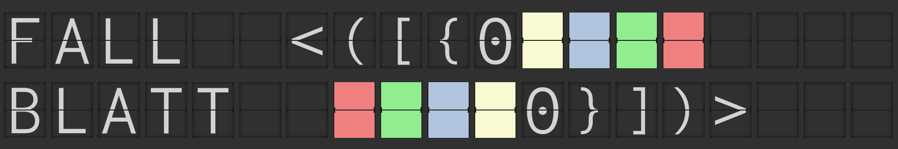

# fallblatt



Ever wondered about those big legacy displays in aiport terminals and train stations? They are called split-flap displays (Fallblattanzeige in German) and consist out of several hundred mechanical segments which rotate to display a set of characters.

The fallblatt jQuery plugin allows you to embed such displays into your web application. Everything from virtual departure and arrival boards up to digital dashboards can be powered with this single plugin.

## Get Started
### Quickstart

To get an overview what fallblatt is capable of doing, open `fallblatt.html` in your browser and enjoy the show. The plugin enlarges the fallblatt canvas to the size of your display and randomly selects new characters for every flap.

If you want to resize the flaps, you can increase or decrease the `flapScale` option of the `fallBlatt()` object. The plugin will always try to arrange the flaps evenly within the given box.

The styling of the entire canvas can be easily modified by changing the respective CSS classes. Have a look at the imported file.

## Plugin
### Requirements

The plugin uses jQuery as a hard dependency. Make sure you have a recent version of jQuery loaded before you create a new instance of `fallBlatt()`.

Per default fallblatt tries to accomodate itself within the parent box that is provided for the rendering of the canvas. If the size of the flaps or the scaling doesn't allow the placement of at least on flap, fallblatt will exit with a console error.

### Options

A new instance of `fallBlatt()` accepts the following parameters:

Key | Default | Comment
--- | --- | ---
`flapHeight` | `120` | **If changed, the charset also needs to be aligned**. Use `flapScale` if you just want to change the size of the flaps. 
`flapWidth` | `90` | **If changed, the charset also needs to be aligned**. Use `flapScale` if you just want to change the size of the flaps.
`flapScale` | `1` | 
`flapSpacingExtraHeight` | `0` | If the plugin renders multiple rows of flaps, you can increase their spacing.
`flapSpacingExtraWidth` | `0` | If the plugin renders multiple columns of flaps, you can increase their spacing.
`flapCharset` | Default charset | Provide a custom charset for the fallblatt plugin. The default charset supports a standard set of characters and colours.
`flapCss` | Default CSS | Overwrite the design of fallblatt elements

Example:

```html
<div id="splitFlapCanvas"></div>
```

```javascript
$("#splitFlapCanvas").fallBlatt({
    flapScale: 2
})
```

### Return Parameters

When instantiating `fallBlatt()`, it yields the following information which describe the current runtime and details of the rendered canvas:

```javascript
return {
    this: this,
    flapsX: sizes.maxFlapsX,
    flapsY: sizes.maxFlapsY
};
```

`flapsX` and `flapsY` contain the amount of flaps rendered per axis. This will help you afterwards when filling the canvas with content.

### Display Content

As soon as the canvas is rendered you can start displaying content. Therefore you have to explicitly call the instance with the `display` keyword. Furthermore you need to provide the position on the canvas and the actual character:

```javascript
$("#splitFlapCanvas").fallBlatt("display", {
    pos: [x,y],
    content: "A"
});
```

The method returns a `$.Deferred().promise()` object which you can use to wait until the rotation of a single character is finished.

`fallBlatt.defaults.flapCharset.chars` contains a list of supported characters.

### Charset

The plugin comes with a default charset based on the Overpass Mono font from Google Fonts (https://fonts.google.com/specimen/Overpass+Mono). When developing new charset for fallblatt, make to sure to use a mono spaced font.

To not only support standard characters, fallblatt comes with six pre defined coloured flaps. You can display them by trying to animate their lowercase representative. The default charset supports:

* `r`: Red
* `b`: Blue
* `g`: Green
* `y`: Yellow
* `o`: Orange
* `w`: White

To prevent single characters from being displayed out of their expected location, you can attach pre defined CSS classes to single characters. Most of the time this happens with special characters and emojis. The `flapCharset.options` setting allows you to set a list of CSS classes per character which will be set for the flap every time the character gets animated within the canvas.

If the fallblatt plugin is confronted with a character outside of its loaded charset, the last character of the charset is animated. In case of the default charset this is the white coloured flap.

# CSS

To modify the overall style of the split flap canvas, you can provide a different set of classes with `flapCss`.
